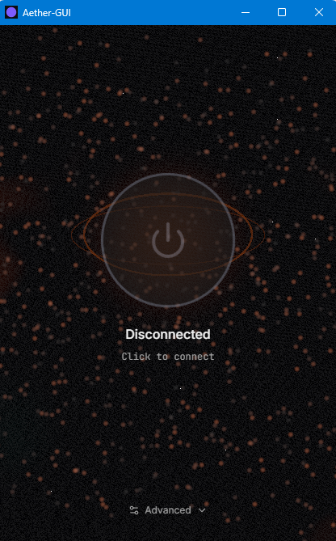

# Aether-GUI

[](https://github.com/MatinSenPai/Aether-GUI/releases)
[](LICENSE)


[English](README.md) · [فارسی](README_fa.md) · **简体中文** · [日本語](README.ja.md)

一款用于 [**Aether**](https://github.com/CluvexStudio/Aether) 的一键式桌面图形界面。Aether 是一款面向高度受限网络的审查规避隧道工具。Aether 本身是一个终端工具：它会找出可用的外连路径、建立加密隧道，并开放本地 SOCKS5 代理。Aether-GUI 将这个终端工具封装进一个小巧、带动画的桌面应用，让你无需接触命令行即可使用——只需按下 Connect，其他工作（身份配置、路径发现、回答提示）都会在后台自动完成。

本项目不会重新实现 Aether 的任何隧道逻辑。它会在伪终端中驱动真正的 `aether` 二进制文件，代替你回答交互式设置提示，并监视输出以告知当前状态。所有实际的审查规避工作——MASQUE/QUIC 混淆、WireGuard、路径探测——均由 [Aether](https://github.com/CluvexStudio/Aether) 完成，而非本仓库。

<p align="center">
  
</p>

## 功能

- **自动模式** — 默认界面只有一个按钮，无需任何配置。它会使用上次成功的设置进行连接（首次运行时使用合理的默认值）。
- **高级面板** — 需要更多控制时，可展开面板来设置 Aether 支持的实际选项：
  - **协议**：MASQUE（将流量伪装成普通 HTTPS）、WireGuard（更轻量、更快），或 WARP-in-WARP/gool（嵌套两个 WireGuard 隧道，以速度为代价换取额外安全性）
  - **扫描模式**：Turbo、Balanced、Thorough、Stealth 或 Ironclad——在路径发现速度与产生的探测流量之间取舍；Ironclad 会通过每个候选路径建立真实隧道并发送真实 HTTP 请求，然后才会信任该路径（最慢，但可保证可用）
  - **IP 版本**：IPv4、IPv6 或两者
  - **MASQUE 传输方式**：HTTP/3（QUIC——握手最快）或 HTTP/2（TCP——看起来与普通 HTTPS 相同，适用于 UDP 被阻止或限速的网络）
  - **混淆**：握手对 DPI 的伪装程度——配置档会根据所选协议调整；如果默认配置无法连通，请提升混淆级别
  - **快速重连**：记住上次可用的网关，并在下次优先重新测试；如果仍然可用，就跳过完整扫描

  将鼠标悬停在每个选项上即可查看说明。
- **实时进度** — Aether 搜索可用路径时，GUI 会显示真实的已用时间；Aether 报告自身扫描预算后，还会显示实际百分比和进度条，而不只是一个旋转指示器。
- **自动重连** — 如果隧道在会话中意外中断（WARP-in-WARP 偶尔会出现这种情况，但所有协议都采用相同处理方式），GUI 会按退避策略自动重试，并明确显示“Reconnecting… (attempt N of 3)”，而不是静默退出或直接把你带回一个简单错误。用户主动断开时绝不会重试。

## 安装

从 [Releases 页面](https://github.com/MatinSenPai/Aether-GUI/releases)获取最新安装程序：

- `Aether-GUI_x.y.z_x64-setup.exe` — 标准安装程序（推荐）
- `Aether-GUI_x.y.z_x64_en-US.msi` — MSI 软件包，适用于脚本化或企业部署

目前仅支持 Windows x64——其他平台请参阅[从源代码构建](#从源代码构建)。

## 从源代码构建

1. **前置要求**
   - [Node.js](https://nodejs.org/) 和 npm
   - [Rust](https://rustup.rs/)（稳定版工具链）
   - Tauri 的平台前置要求——请参阅 [Tauri v2 前置要求指南](https://v2.tauri.app/start/prerequisites/)（Windows 需要 MSVC C++ Build Tools 和 WebView2 Runtime，两者通常已经安装；macOS 需要 Xcode Command Line Tools；Linux 需要 `webkit2gtk` 等依赖）

2. **安装前端依赖**

   ```sh
   npm install
   ```

3. **获取 Aether 二进制文件**

   Aether-GUI 会打包来自 [CluvexStudio/Aether releases](https://github.com/CluvexStudio/Aether/releases) 的真正 `aether` 二进制文件，而不是自行构建它——本仓库只提供 GUI。请获取适用于你平台的文件并验证其校验和：

   ```sh
   ./src-tauri/binaries/fetch-aether.sh
   ```

   此脚本直接支持 Linux 和 macOS。在 Windows 上，请自行从 [Aether releases 页面](https://github.com/CluvexStudio/Aether/releases)下载匹配的 `aether-windows-*.zip`，使用已发布的 `SHA256SUMS.txt` 进行验证，并将 `aether.exe` 解压到 `src-tauri/binaries/`。

4. **以开发模式运行**

   ```sh
   npm run tauri dev
   ```

5. **构建发布安装程序**

   ```sh
   npm run tauri build
   ```

   安装程序会生成在 `src-tauri/target/release/bundle/` 下（Windows 上为 NSIS `.exe` 和 `.msi`；macOS 上为 `.dmg`/`.app`；Linux 上为 `.deb`/`.AppImage`/`.rpm`——每个平台的软件包必须在相应操作系统上构建，也可以通过 CI 构建）。

## 工作原理

- **前端**：React 19 + Tailwind v4，使用 Zustand 管理状态，并通过 [Motion](https://motion.dev/) 制作动画——所有功能都通过 Tauri 的 IPC 与 Rust 后端通信。应用特意保持轻量：环境背景仅由两个只在合成器中运行的 CSS 渐变光球组成，窗口失去焦点时所有循环动画都会暂停，因此应用在后台几乎不消耗资源。
- **后端**：Rust，使用 [`portable-pty`](https://docs.rs/portable-pty) 在真正的伪终端中启动真正的 `aether` 二进制文件（v1.3.0）。你选择的配置——协议、扫描模式、IP 版本、MASQUE 传输方式（HTTP/3 或 HTTP/2）、混淆配置和快速重连——会预先通过 CLI 标志和环境变量传递，因此 Aether 的交互式提示通常不会出现；后台线程仍会监视输出，并能回答任何实际出现的提示，同时将每一行实时转发到 GUI 的日志面板。
- **“已连接”的事实依据**：GUI 不会只相信 Aether 的日志措辞（不同版本间可能变化，因此并不可靠），而是将成功连接到本地 SOCKS5 端口（`127.0.0.1:1819`）的 TCP 连接视为隧道已经建立的实际证明。
- **状态机**：`Idle → Launching → Connecting → Connected`，其中 `Reconnecting` 和 `Error` 是连接尝试结束后需要你注意的两种状态——`Reconnecting` 会自动重试（采用退避策略，最多 3 次）；当重试用尽或问题不可重试（例如二进制文件本身缺失）时，`Error` 即为最终状态。

## 关于 Aether

[Aether](https://github.com/CluvexStudio/Aether) 是本应用封装的实际审查规避引擎——一个独立的终端工具，它不依赖任何 GUI，即可发现可达路径并建立隧道。如果你更愿意直接在终端中使用它，或希望了解其底层工作的准确方式，请阅读该仓库。Aether-GUI 的唯一目的，是让不想长期使用终端的用户只需点击一次即可使用该工具。

## 许可证

[GNU Affero General Public License v3.0](LICENSE)。
